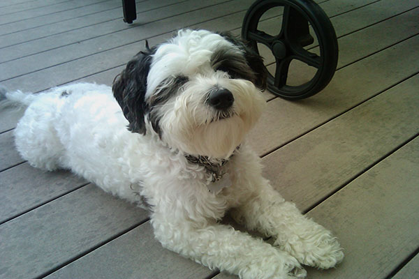
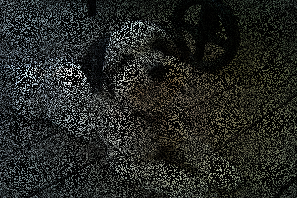
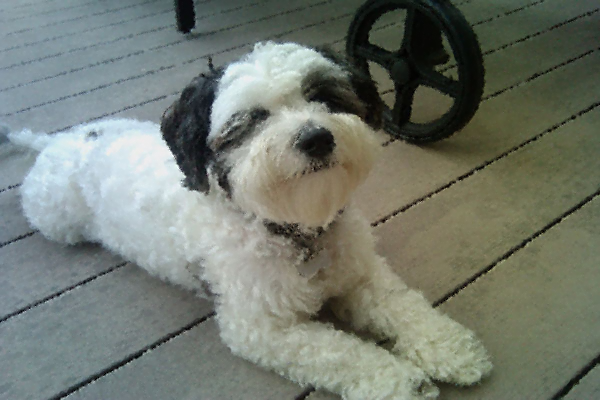

# Image RePainting

Python script for performing image inpainting of dead pixels.

### Prerequisites

NumPy and PIL (i.e. Pillow) need to be installed in order for the script to work properly. Install them by running this command from the project directory after cloning the repository:

```
pip install -r requirements.txt
```

### Example

Suppose we start with this (non-damaged) image placed in the data/img directory:



Then a 70 percent damaged image would be:



Attempting to restore the initial dog1 image using the Gaussian Averaging Block Algorithm yields:



## Built With

* [Pillow](https://python-pillow.org/) - Python Imaging Library (PIL fork)
* [NumPy](http://www.numpy.org/) - Python Linear Algebra Library

## License

This project is licensed under the MIT License - see the [LICENSE.md](LICENSE.md) file for details

## Acknowledgments

* [README template](https://gist.github.com/PurpleBooth/109311bb0361f32d87a2 )
